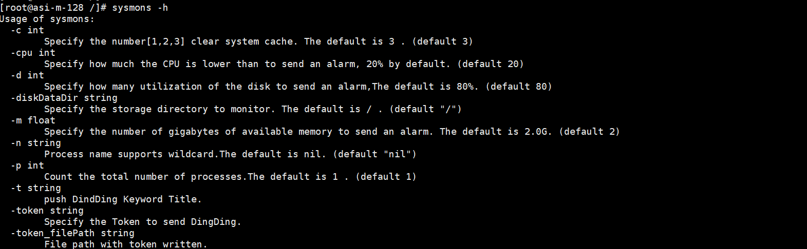

# sysmons

这是一个用go语言编写的自动监控和推送加告警抑制的工具，目前是实现了3大件的临时监控。还不完善，适合突发情况顶替使用。也可以自定义二次开发。

### 使用

```bash
sysmon -m=0.1 -t=mysql_001 -token="xxxxxxxxxxxx" 
```

### 参数介绍

```
-c: 清理系统缓存级别
-cpu: cpu告警临界点
-d: 磁盘告警临界点
-diskDataDir: 磁盘挂载的主要数据目录临界点
-m: 内存告警临界点
-n: 要监控的进程名字
-p: 要监控的进程数量,和-n搭配使用
-t: 钉钉告警头部关键字
-token: token写在命令行
-token_filePath: token文件路径
```


